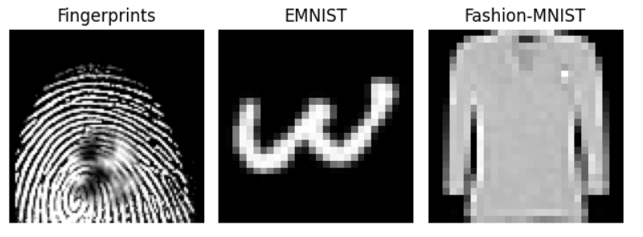
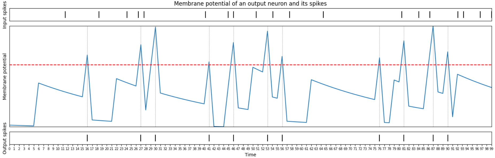

# SNN image classification
Comparison of Spiking Neural Network and Convolutional Neural Network for Image Classification using snnTorch.

## Project Description

Artificial neural networks, including deep neural networks, are widely used for solving machine learning problems. However, these networks are not biologically plausible. Spiking neural networks (SNNs), on the other hand, use different methods of encoding and processing data, making their behavior more similar to brain activity. This motivated us to explore SNNs in more detail and compare their performance with convolutional neural networks (CNNs) in solving image classification problems.

## Repository Contents

- Jupyter notebook with code for implementing and evaluating the SNN and CNN models on the three datasets
- README file with project details and description

## Used datasets

- SOCOFing - a set of biometric fingerprints and their synthetic alterations. With this dataset, we solve the problem of fingerprint image classification on 10 classes depending on the name of the finger.
- EMNIST digits - a set of handwritten digits similar to the MNIST dataset, but 4 times larger. 
- Fashion-MNIST - a set of 10 fashion products images. 

## Key methodology components

- Rate-encoding
- LIF neuron model
- Data preprocessing
- Train/validation/test with snnTorch
- CrossEntropy loss
- Adam optimizer
- SNN and CNN comparison

## Model architecture
In this project, we created models of SNN and CNN. Used datasets has a different size of images, so models vary only in the number of neurons on the input layer in SNN and on first fully-connected layer in CNN.
For both of them, we used the Adam optimizer to update the weights with a constant learning rate of 0.000085, a batch size of 128 and cross-entropy loss function. 

- SNN
We used a SNN with one hidden fully-connected layer with 1024 hidden units. Note that all neurons operates with spikes.
The following table and image represents the architecture of SNN.

| Layer | Parameters |
|-------|-------|
| Linear | input = 9409, output = 1024  |
| Leaky  | beta = 0.95 |
| Linear | input = 1024, output = 10    |
| Leaky  | beta = 0.95 |

- CNN
We have constructed a CNN model with which we compared the SNN model described earlier. It consists of Convolutanal layer with ReLU activation function, MaxPool layer, Convolutanal layer with ReLU activation function, MaxPool layer, and two fully-connected layers. 
The following table and image represents the architecture of CNN.

| Layer | Parameters |
|-------|-------|
| Conv2d | input channels = 1, output channels = 16, kernel size = (3, 3), stride = (1, 1), activation = ReLU  |
| MaxPool2d  | kernel size = 2, stride = 2, padding = 0 |
| Conv2d | input channels = 16, output channels = 32, kernel size = (3, 3), stride = (1, 1), activation = ReLU    |
| MaxPool2d  | kernel size = 2, stride = 2, padding = 0 |
| Linear | input = 15488, output = 1024, activation = ReLU  |
| Linear | input = 1024, output = 10, activation = log softmax  |

## Visualization of output neuron
Leaky Integrate-and-Fire (LIF) neuron receives the sum of the weighted input signals. LIF integrates the inputs over time. If the integrated value exceeds a predefined threshold, the LIF neuron produces a spike.

As a result, the information is not stored in spikes, but rather in its frequency.

We plotted the behavior of an LIF neuron receiving input spikes over 100 time steps.

## Results

For SOCOFing dataset SNN model outperformed the CNN model and obtained the 98% accuracy, in comparison with 83% for CNN. For both EMNIST, and Fashion-MNIST datasets SNN and CNN showed approximately the same results: 98% accuracy for EMNIST and 86% accuracy for Fashion-MNIST. However, training of one epoch for SNN was, on average, 1.5 times slower than for CNN.

| Dataset       | Model | Accuracy | Precision | Recall | F1-score |
|-------------  |-------|----------|-----------|--------|----------|
| SOCOFing      | SNN   | 0.98     | 0.98      | 0.98   | 0.98     |
| SOCOFing      | CNN   | 0.83     | 0.84      | 0.82   | 0.83     |
| EMNIST        | SNN   | 0.99     | 0.99      | 0.99   | 0.99     |
| EMNIST        | CNN   | 0.99     | 0.99      | 0.99   | 0.99     |
| Fashion-MNIST | SNN   | 0.86     | 0.86      | 0.87   | 0.86     |
| Fashion-MNIST | CNN   | 0.86     | 0.86      | 0.86   | 0.86     |

## Requirements

- Python 3.x
- snnTorch
- PyTorch
- NumPy
- Matplotlib
- Pandas
- Kaggle API

## Usage

- Clone the repository to your local machine.
- Install the required libraries.
- Obtain a Kaggle API token to download the SOCOFing dataset.
- Run the Jupyter notebook and follow the instructions to train and evaluate the SNN and CNN models on the three datasets.

## Authors

- [Danila Shulepin](https://github.com/D4ni1a)
- [Sofi Zaitseva](https://github.com/sofi12321)
- [Arsen Mutalapov](https://github.com/system205)

## License

This project is licensed under the MIT License - see the LICENSE file for details.
